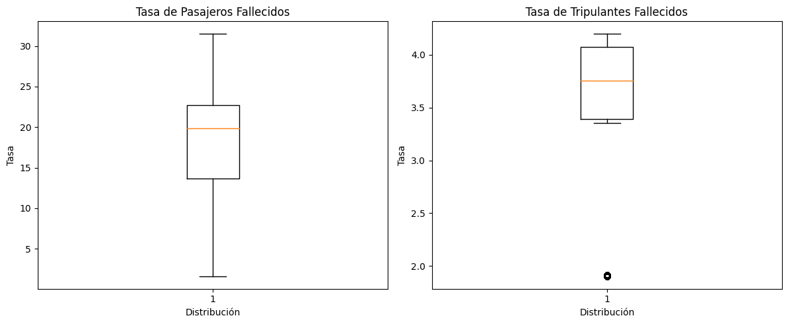
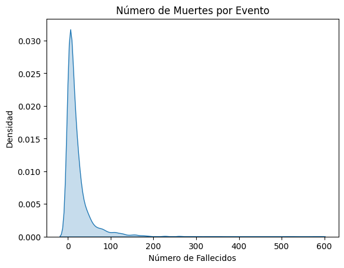
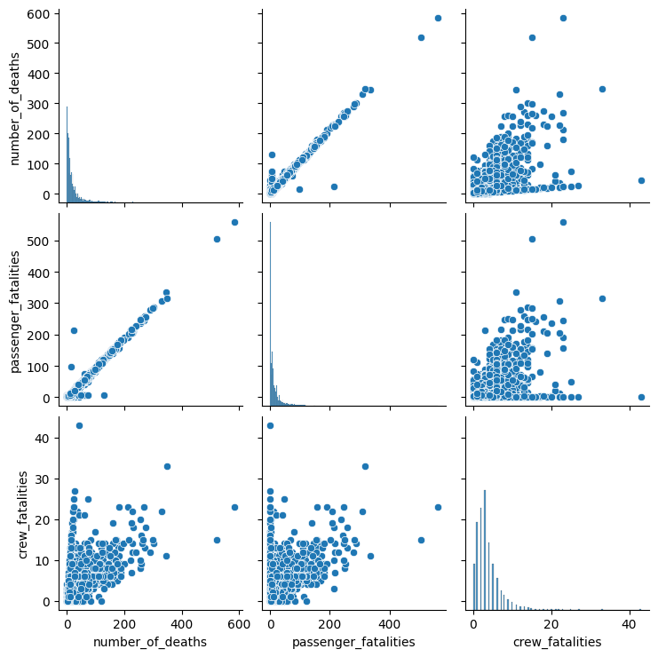
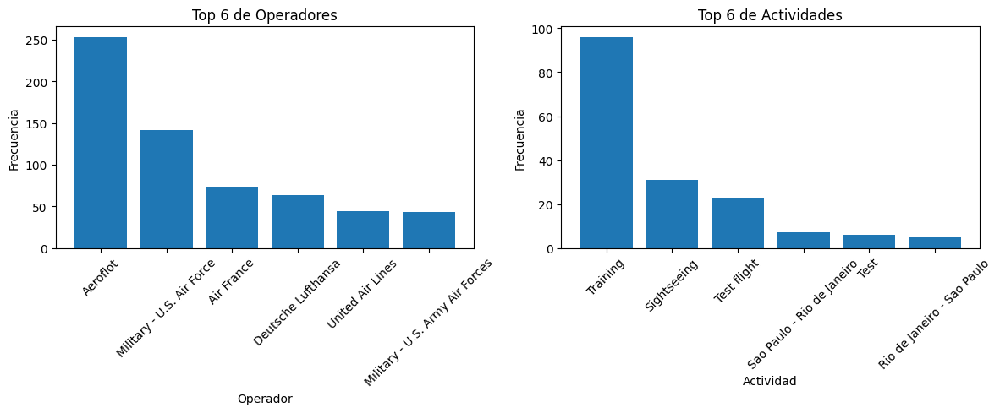
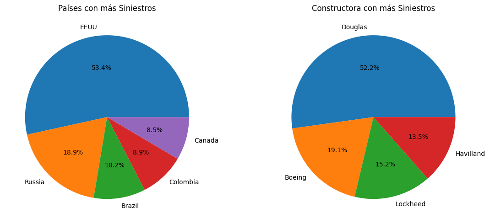
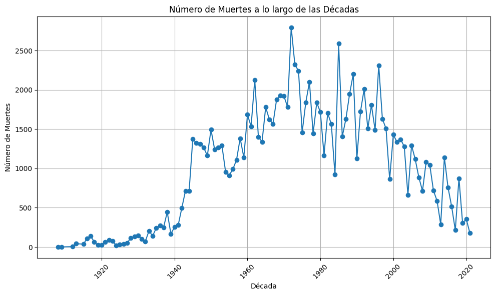
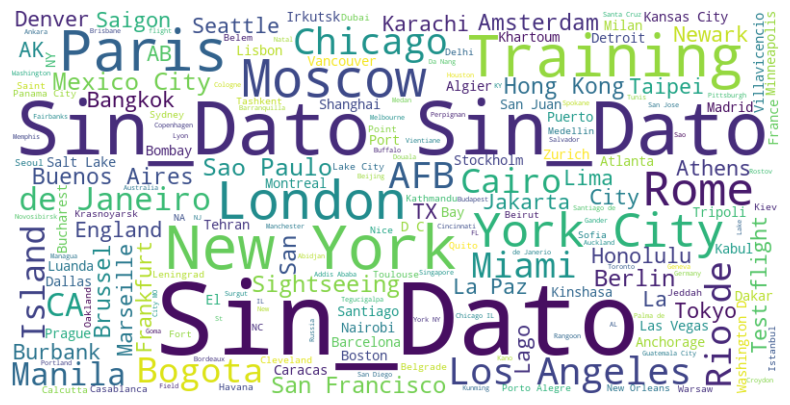
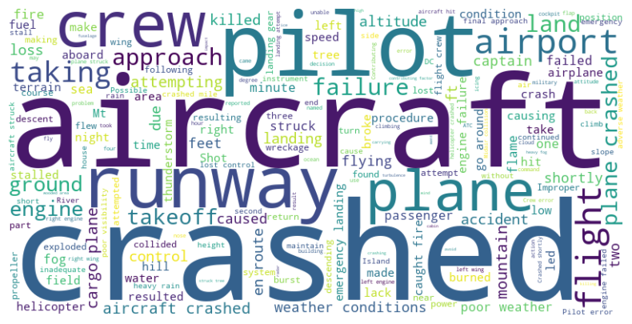
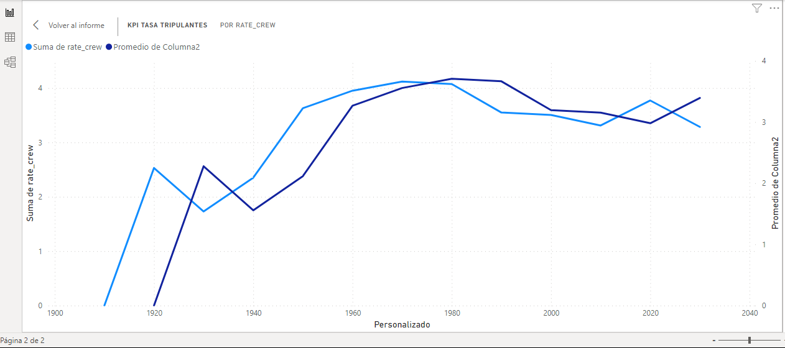
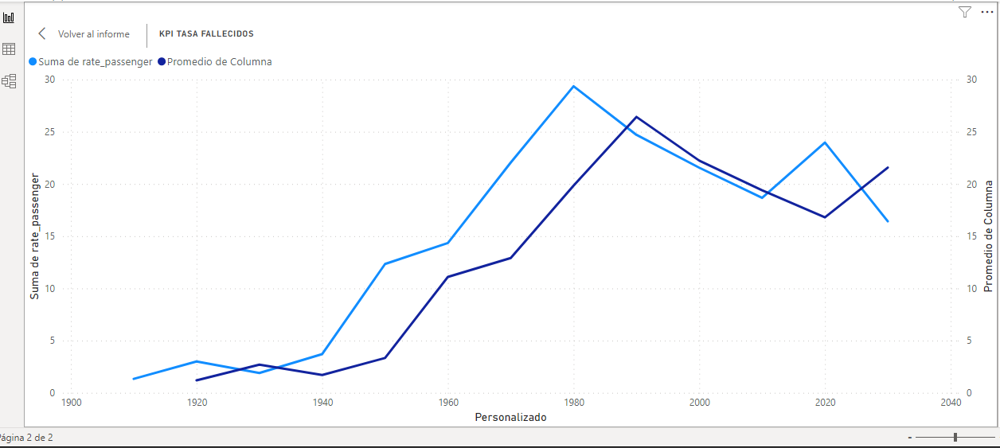

<h1 align="center"> ACCIDENTES AEREOS OACI  </h1>

# INDICE 
<!-- TABLA DE CONTENIDO -->

  
TABLA DE CONTENIDO

  <ol>  
    <li><a href="#INTRODUCCION">INTRODUCCION</a></li>
    <li><a href="#OBJETIVO">OBJETIVO</a></li>
    <li><a href="#CONJUNTO-DE-TECNOLOGIAS">CONJUNTO DE TECNOLOGIAS</a></li>
    <li><a href="#EDA">EDA</a></li>
    <li><a href="#KPI's">KPI's</a></li>    
    <li><a href="#CONCLUSIONES">CONCLUSIONES</a></li>
  </ol>

# INTRODUCCION.

El presente proyecto analiza el conjunto de datos de la Organización de Aviación Civil Internacional (OACI),
que entrega información acerca de accidentes aéreos presentados a nivel mundial entre los años 1908 y 2021. En el análisis exploratorio de datos se logra conocer, entre otras cosas, el país con mas número de accidentes, el fabricante de aviones menos afortunado, las rutas de vuelo mas siniestradas, aparece también que las pruebas de vuelo, las demostraciones y las operaciones militares aportan un gran número de accidentes.

# OBJETIVO.

1. Analizar a profundidad el conjunto de datos para obtener información relevante acerca de los accidentes.

2. Entender el mensaje que los datos estan entregando, basado en la interpretación de las variables numéricas y categóricas y la relación entre ellas.

3. Realizar un tablero de control que presente la información analizada de manera clara y concisa, con una historia coherente y conclusiones acertadas.

4. Graficar en el tablero de control dos indicadores de gestión, el propuesto en el proyecto y el decidido por mi, reducción del 10% de la tasa de fallecimientos de tripulantes (propuesto en el proyecto) y de pasajeros (propuesto por el autor) respecto de la decada anterior.

5. Construir un README detallado con el fin que el lector comprenda los puntos anteriores y sea suficiente para exponer el trabajo realizado por mi.

# CONJUNTO DE TECNOLOGIAS.

# EDA.

1. HISTOGRAMA.

En el desarrollo del análisis exploratorio de datos, es inevitable no caer en la tentación, de empezar por conocer el comportamiento de la cantidad de fallecidos de tripulantes y pasajeros y el número de accidentes en los que se han visto involucrados. Y es que el conjunto de datos es precisamente sobre accidentes aéreos y fallecidos. Escrito esto la imagen a continuación:

Evidentemente la realidad enseña que en un avión viajan mas pasajeros que tripulantes y las gráficas muestran que es desproporcionado el número de víctimas entre el primero y el segundo grupo, en el conjunto de datos estudiado. En pocos casos los pasajeros superan las 300 victimas en un siniestro, ha no ser que ocurra una tragedia de tipo terrorista (ataques a EEUU) o una desaparición durante un vuelo (Malasya Airlines).

2. DIAGRAMA DE CAJA.

Este diagrama tiene en cuenta las tasas de fallecimiento y su respectiva distribución, está mas agrupada la tasa que corresponde a los tripulantes fallecidos, normalmente el número de tripulantes es el mismo vuelo a vuelo, no así el de pasajeros.

El valor por fuera de los bigotes corresponde a una disminución significativa de la tasa de fallecimiento de los tripulantes.

3. GRAFICO DE DENSIDAD.

La cantidad de muertes reportadas por accidentes aéreos muestra un número de fallecidos inferior a 10 por evento,una de las razones es la baja frecuencia de vuelos al inicio de la industria, otra, es que los viajes en avión hoy por hoy son el medio de transporte mas confiable y seguro que hay, gracias al avance de la ingeniería aeronaútica.

4. GRAFICO DE PARES.

La diagonal principal de la gráfica dice que la variable númerica de tripulantes fallecidos no es directamente proporcional a la variable número de muertes (los tripulantes no aportan gran número de vítimas) al contrario que la cantidad de pasajeros fallecidos, dicho de otra manera la mayor cantidad de fallecimientos totales son de pasajeros. Este resultado es lógico y esperado, en las aeronaves van más pasajeros que tripulantes.
Ahora bien, no hay relación entre pasajeros y tripulantes, son grupos excluyentes la misma persona no clasifica al mismo tiempo en los dos grupos de estudio.

5. DIAGRAMA DE BARRAS.

La aerolínea rusa Aeroflot es la que mas veces se repite en el conjunto de datos analizado, tambien las fuerzas militares de EEUU, cuando de analizar la columna de operadores se trata. En esa misma columna aparecen actividades como el entrenamineto de vuelo y el turismo como las principales acciones cuando ocurren los siniestros.

6.  GRAFICO DE PASTEL.

La aeronave de la constructora Douglas es la que más veces aparece en el análisis del conjunto de datos, es de origen estadounidense, se puede creer que durante las pruebas de sus aviones en suelo norteamericano se presentaron muchos accidentes (EEUU es el país con mas números de siniestros). Dato: Boeing también es estadounidense.

7. GRAFICO DE LINEAS.

La gráfica muestra como con el paso del tiempo la cantidad de accidentes ha aumentado. Al principio del siglo XX la cantidad de fallecidos no tenia los números que a mitad de siglo, los accidentes se mitigaron por la baja frecuencia de vuelos y aparecieron por la inseguridad de los aviones . Para inicios del siglo XXI la tendencia es a la baja dado los avances en ingeniería y el uso de tecnologías de geoposición y ayudas como chalecos salvavidas y fuselajes de materiales cada vez mas resistentes.

8. NUBE DE PALABRAS.

Existe una columna en el conjunto de datos que se llama Route y hace referencia a la ruta que cubría el vuelo el dia del accidente. Con la ayuda de nube de palabras se resalta el nombre de las ciudades que mas veces aparece en dicha columna.

Paris, New York, Londres, Miami, Rio de Janeiro y Moscú se cuentan entre las ciudades mas visibles.

9. NUBE DE PALABRAS COLUMNA SUMMARY.

La columna summary entrega una descripción de aquellos eventos y posibles causas que rodearon el siniestro. Con la ayuda de una nube de palabras se busca encontrar la clave que devele el misterio del siniestro. Es asi que se evidencia que la frase 'se estrelló' es una de las mas visibles, las palabras aeronave, pista. tripulación, avión y piloto resaltan a primera vista.

# KPI's.

1. El KPI propuesto por el proyecto es reducir en un 10% la tasa de tripulantes fallecidos respecto de la década anterior. Aquí la imagen del comportamiento a lo largo de las décadas de la suma de tripulantes fallecidos y su correspondiente tasa(se define la tasa de fatalidad de la tripulación como el número total de tripulantes fallecidos en los accidentes registrados en la década a considerar, dividido en la cantidad total de accidentes aéreos ocurridos en este período de tiempo. Su fórmula es: suma total de fallecidos en el período de tiempo / suma total de accidentes en el período de tiempo).

La gráfica muestra en la linea azul clara el comportamiento de la tasa de tripulantes fallecidos a lo largo del periodo de tiempo estudiado, la pendiente positiva significa incremento y la negativa decrecimiento. La línea azul oscura muestra el comportamiento del KPI, o sea es la tasa que se espera obtener(-10%), de esa manera en 1930 se esperaba una tasa de 2.28 y se obtuvo una de 1.73, en 1990 se esperaba una tasa de 3.67 y se obtuvo una de 3.55, en 2030 (lo que va corrido de esta década) se esperaba una tasa de 3.39 y se obtuvo una de 3.29, estas son las décadas donde el KPI se cumple.

2. El KPI propuesto por el autor es reducir en un 10% la tasa de pasajeros fallecidos respecto de la década anterior. Aquí la imagen del comportamiento a lo largo de las décadas de la suma de pasajeros fallecidos y su correspondiente tasa(se define la tasa de fatalidad de los pasajeros como el número total de pasajeros fallecidos en los accidentes registrados en la década a considerar, dividido en la cantidad total de accidentes aéreos ocurridos en este período de tiempo. Su fórmula es: suma total de fallecidos en el período de tiempo / suma total de accidentes en el período de tiempo).

La gráfica muestra en la linea azul clara el comportamiento de la tasa de pasajeros fallecidos a lo largo del periodo de tiempo estudiado, la pendiente positiva significa incremento y la negativa decrecimiento. La línea azul oscura muestra el comportamiento del KPI, o sea es la tasa que se espera obtener(-10%), de esa manera en 1930 se esperaba una tasa de 2.70 y se obtuvo una de 1.90, en 1990 se esperaba una tasa de 26.43 y se obtuvo una de 24.71, en 2000 se esperaba una tasa de 22.24 y se obtuvo una de 21.56, en 2010 se esperaba una tasa de 19.40 y se obtuvo una de 18.67, en 2030 (lo que va corrido de esta década) se esperaba una tasa de 21.57 y se obtuvo una de 16.43 estas son las décadas donde el KPI se cumple.

# CONCLUSIONES.

1. El conjunto de datos nos da información acerca de la aerolínea mas siniestrada, entre las que se cuentan Aeroflot y Air France como las mas representativas, con mas de 300 participaciones en hechos trágicos. Las fuerzas miitares de varios paises aportan un gran número de víctimas.

2. Dentro de las actividades mas peligrosas están las relacionadas con el turismo, la práctica de vuelo y el entrenamiento en aeronaves nuevas.

3. No existe una ruta que se pueda marcar como peligrosa o temida, en el conjunto de datos hay gran variedad de rutas, es tan extenso el universo de viajes que se concluye que no es una medida de siniestralidad. Hay una gran cantidad de valores únicos. Los accidentes ocurren en cualquier lugar del mundo, cubriendo cualquier ruta, sea larga o corta.

4. Los cielos de Rusia y EEUU son el escenario de mas accidentes con víctimas fatales, el 72% de los hechos ocurren allí. 

5. Respecto de las aeronaves, los fabricantes Douglas, Boeing y Havilland encabezan la oscura lista de los menos afortunados, en el 84% de los accidentes registrados en el conjunto de datos aparecen sus nombres.

6. Gráficamente en lo que respecta al análisis de los KPI's, si la linea azul clara está por debajo de la oscura es un indicador que posiblemente en esa área se cumplió el KPI, hay casos en los que esto ocurre, pero, no alcanza el KPI.

7. La cantidad de pasajeros muertos es directamente propocional al número de victimas totales (es el grupo que mas víctimas registra, cuando el número de pasajeros aumenta tambien lo hace el de víctimas), los tripulantes son el 15% del total de fallecidos (17778 de 111396).
