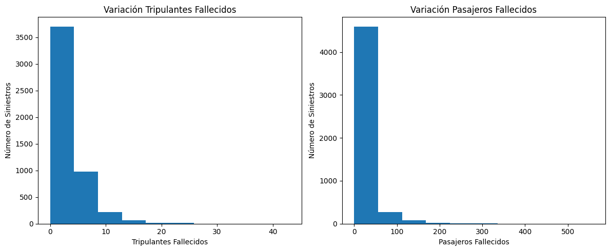

<h1 align="center"> Accidentes Aereos  </h1>

https://th.bing.com/th/id/R.5554814c2a1e3fcae2fd53f3ad1c81c2?rik=g29HUUEaqtLZ0g&riu=http%3a%2f%2f3.bp.blogspot.com%2f-7bc3GooJBHg%2fTVRooDxkVOI%2fAAAAAAAAABI%2fohZzSQy5MBk%2fw1200-h630-p-k-no-nu%2fflight815-des.jpg&ehk=gr%2brjd9uxyZS48qM4lNQLViZpmaA8s%2fyWjvJVggfpAI%3d&risl=&pid=ImgRaw&r=0

# INTRODUCCION.

El presente proyecto analiza el conjunto de datos de la Organización de Aviación Civil Internacional (OACI),
que entrega información acerca de accidentes aéreos presentados a nivel mundial entre los años 1908 y 2021. En el análisis exploratorio de datos se logra conocer, entre otras cosas, el país con mas número de accidentes, el fabricante de aviones menos afortunado, las rutas de vuelo mas siniestradas, aparece también que las pruebas de vuelo, las demostraciones y las operaciones militares aportan un gran número de accidentes.

as

Data Analyst

Evaluar la disminución de un 10% la tasa de fatalidad de la tripulación en los últimos 10 años, comparado a la década anterior.

Definimos la tasa de fatalidad de la tripulación como el número total de tripulantes fallecidos en los accidentes registrados en la década a considerar, dividido en la cantidad total de accidentes aéreos ocurridos en este período de tiempo. Su fórmula es (Suma total de fallecidos en el período de tiempo / Suma total de accidentes en el período de tiempo).